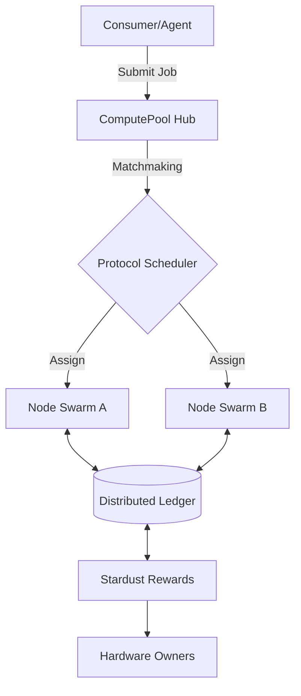

# ⚡ ComputePool: The Sovereign Compute Protocol

[](https://opensource.org/licenses/Apache-2.0)
[](https://man44.zo.space/compute-pool)
[](https://stardance.hackclub.com)

**ComputePool is a decentralized orchestration layer that aggregates global GPU/CPU capacity into a unified, programmable marketplace.**

Unlike centralized providers (AWS/GCP), ComputePool allows any individual or organization to monetize their hardware by joining a sovereign swarm. It provides the infrastructure for AI agents, research labs, and gaming studios to rent high-performance compute at a fraction of traditional costs.

## 🌟 Key Pillars

- **Zero-Trust Orchestration**: Hardware nodes are verified via cryptographic heartbeats and quality-of-service (QoS) staking.
- **Agent-First Architecture**: Designed natively for autonomous swarms (like Omega-System) to dynamically spin up worker nodes.
- **Cross-Platform Agent**: A lightweight Python binary that instantly turns any machine (Linux, macOS, Windows) into a revenue-generating node.
- **Tokenized Economy**: Automated payouts in Stardust/Credits based on TFLOPS-hours contributed.

## 🏗 System Architecture



## 🛠 Feature Stack

- [x] **Dynamic Node Discovery**: Real-time hardware capability sensing (NVIDIA SMI, GPUtil integration).
- [x] **Redundant Hub API**: High-availability FastAPI backend with PostgreSQL/Neon persistence.
- [x] **Secure Job Execution**: Sandboxed execution of ML training and generic compute scripts.
- [ ] **Global TFLOPS Map**: Real-time visualization of geographic compute density.
- [ ] **P2P File Mesh**: IPFS-backed result CID storage and retrieval.

## 📦 Rapid Deployment (1-Click)

```bash
# Clone the repository
git clone https://github.com/AmSach/compute-pool.git
cd compute-pool

# Join the network as a worker node
export HUB_URL="http://127.0.0.1:8081"
export NODE_NAME="my-power-node"
python3 backend/agent.py
```

## 📊 Live Dashboard
Monitor network health, active nodes, and job throughput in real-time:
[**https://man44.zo.space/compute-pool**](https://man44.zo.space/compute-pool)

---
*Developed for the Hack Club Stardance Challenge. Building the future of distributed intelligence.*
